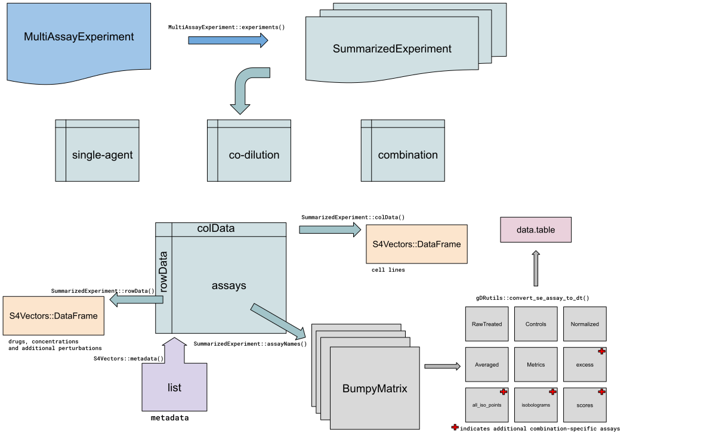

# gDR -- data model

Abstract

This vignette comprehensively describes the data model used in the
gDRsuite.

## Introduction

This vignette is dedicated to providing an in-depth exploration of the
underlying data model employed in the gDR suite, with a focus on the
versatile
*[MultiAssayExperiment](https://bioconductor.org/packages/3.23/MultiAssayExperiment)*
object – the cornerstone of the gDR ecosystem. The vignette delves into
the intricacies of the data model, shedding light on how different
components are organized within the
*[MultiAssayExperiment](https://bioconductor.org/packages/3.23/MultiAssayExperiment)*
object. As the basic and essential object in the gDR, the
*[MultiAssayExperiment](https://bioconductor.org/packages/3.23/MultiAssayExperiment)*
encapsulates the diverse dimensions of drug response data, providing a
unified and coherent framework for analysis. Our primary goal is to
equip users with a detailed understanding of the gDRsuite data model and
its utilization within the
*[MultiAssayExperiment](https://bioconductor.org/packages/3.23/MultiAssayExperiment)*
object. Through practical examples and thorough explanations, we aim to
demonstrate how gDRcore’s core functions and pipeline facilitate
efficient analysis, providing valuable insights into drug response
dynamics. More information about the data processing can be found in the
*[gDRcore](https://bioconductor.org/packages/3.23/gDRcore)*.

gDR data model

## General overview of the data model

In the gDR suite, the culmination of drug response data is encapsulated
in the form of a
*[MultiAssayExperiment](https://bioconductor.org/packages/3.23/MultiAssayExperiment)*
object, representing a versatile and cohesive framework for the analysis
of diverse experimental scenarios.

### Supported Experiments:

The gDR suite accommodates three primary types of experiments within the
*[MultiAssayExperiment](https://bioconductor.org/packages/3.23/MultiAssayExperiment)*
object:

1.  `single-agent` experiment: This involves the assessment of drug
    responses to a single agent, providing insights into individual
    treatment effects.

2.  `combination` experiments: This explores the interactions between
    multiple agents, unraveling the complexities of combined drug
    treatments and their effects.

3.  `co-dilution` experiments: Focused on studying the effects of
    diluting concentrations of compounds, codilution experiments provide
    valuable data on the concentration-dependent aspects of drug
    responses.

### SummarizedExperiment objects:

Each experiment within the
*[MultiAssayExperiment](https://bioconductor.org/packages/3.23/MultiAssayExperiment)*
is represented as a
*[SummarizedExperiment](https://bioconductor.org/packages/3.23/SummarizedExperiment)*
object. This encapsulates the essential components necessary for
comprehensive analysis:

- `assays`: Containing the actual data, assays provide a numerical
  representation of drug responses and associated experimental
  measurements. In gDR, assays are represented by
  *[BumpyMatrix](https://bioconductor.org/packages/3.23/BumpyMatrix)*
  object.

- `rowData`: Encompassing information related to features, rowData
  provides context on the entities being analyzed, such as drugs,
  compounds, or concentrations. In gDR, rowData are represented by
  `DataFrame` object from
  *[S4Vectors](https://bioconductor.org/packages/3.23/S4Vectors)*

- `colData`: Describing the experimental conditions, colData captures
  metadata associated with the cell lines, including tissues, reference
  division time, and any relevant covariates. In gDR, colData are
  represented by `DataFrame` object from
  *[S4Vectors](https://bioconductor.org/packages/3.23/S4Vectors)*

- `metadata`: Offering additional information about the experiment,
  metadata provides a contextual layer to enhance the understanding of
  the experimental setup.

## MultiAssayExperiment object

At its core, the
*[MultiAssayExperiment](https://bioconductor.org/packages/3.23/MultiAssayExperiment)*
object is designed to hold a collection of
*[SummarizedExperiment](https://bioconductor.org/packages/3.23/SummarizedExperiment)*
objects, each representing a distinct experiment type within the gDR
suite. This simplicity ensures a clean and efficient organization of
data, facilitating a user-friendly experience.

To extract specific experiments from the
*[MultiAssayExperiment](https://bioconductor.org/packages/3.23/MultiAssayExperiment)*
object, the `[[` operator can be used For example, to access the data
related to combination experiments, one can use `MAE[["combination"]]`,
where `MAE` represents the
*[MultiAssayExperiment](https://bioconductor.org/packages/3.23/MultiAssayExperiment)*
object.

To gain insights into the available experiments within the
*[MultiAssayExperiment](https://bioconductor.org/packages/3.23/MultiAssayExperiment)*
object, the
[`MultiAssayExperiment::experiments`](https://github.com/waldronlab/MultiAssayExperiment/reference/MultiAssayExperiment-methods.html)
function can be used.

## SummarizedExperiment object

The
*[SummarizedExperiment](https://bioconductor.org/packages/3.23/SummarizedExperiment)*
object emerges as a pivotal structure, integrating drug response data
with essential metadata. This versatile container plays a central role
in the storage of information related to drugs, cell lines, and
experimental conditions, providing a comprehensive foundation for
nuanced analysis within the gDR.

The
*[SummarizedExperiment](https://bioconductor.org/packages/3.23/SummarizedExperiment)*
object in gDR contains four essential components:

### Assays

This section encapsulates the drug response data itself, offering a
numerical representation of experimental measurements. Whether it
involves single-agent studies, combination treatments, or co-dilution
experiments, the assays contain crucial data points for analysis. The
list of available assays for a given gDR experiment can be obtained
using
[`SummarizedExperiment::assayNames`](https://rdrr.io/pkg/SummarizedExperiment/man/SummarizedExperiment-class.html)
on the
*[SummarizedExperiment](https://bioconductor.org/packages/3.23/SummarizedExperiment)*
object. The extraction of a specific `assay` can be done using
[`SummarizedExperiment::assay`](https://rdrr.io/pkg/SummarizedExperiment/man/SummarizedExperiment-class.html)
function, i.e. `SummarizedExperiment::assay(se, "Normalized")`, where
`se` is the
*[SummarizedExperiment](https://bioconductor.org/packages/3.23/SummarizedExperiment)*
object, and `Normalized` is the name of the assay within the experiment.

The gDR experiments contain two sets of assays. One set is for
single-agent and co-dilution experiments (five basic assays), and
another set is for combinations experiments (five basic assays plus four
– combination-specific).

List of assays (combination-specific assays were marked with the
asterisk):

1.  RawTreated – stores treated references
2.  Controls – represents untreated, control references
3.  Normalized – represents normalized data to compute RelativeViability
    and GRValues (default gDR normalization types)
4.  Averaged – stores averaged replicates computed by the mean and
    standard deviation
5.  Metrics – contains fitted response curves
6.  excess (\*) – excess data for each pair of concentration values
    (represents Bliss excess, HSA excess, and data smoothing values)
7.  all_iso_points (\*) stores isobologram points
8.  isobolograms (\*) – stores isobologram curves
9.  scores (\*) – scores data for each pair of concentration values (HSA
    score, Bliss Score, and CI (combination index) scores)

All assays are stored as
*[BumpyMatrix](https://bioconductor.org/packages/3.23/BumpyMatrix)*
objects.

Assays represented by numbers 3-9 additionally contain information about
`normalization_type` to distinguish different metrics calculated for
each normalization type (RelativeViability and GRValues by default).

In gDR
*[BumpyMatrix](https://bioconductor.org/packages/3.23/BumpyMatrix)*
objects can be easily transformed into the
*[data.table](https://CRAN.R-project.org/package=data.table)* object
using
[`gDRutils::convert_se_assay_to_dt`](https://gdrplatform.github.io/gDRstyle/reference/convert_se_assay_to_dt.html)
function. This function also includes information from the rowData and
colData.

### rowData

`rowData` provides context on the features being analyzed, `rowData` is
dedicated to information about drugs, compounds, or concentrations with
their annotations from the database. Additional perturbations and
replicates might be also stored in the `rowData`.

`rowData` can be extracted from the
*[SummarizedExperiment](https://bioconductor.org/packages/3.23/SummarizedExperiment)*
object using
[`SummarizedExperiment::rowData`](https://rdrr.io/pkg/SummarizedExperiment/man/SummarizedExperiment-class.html)
function.

### colData

`colData` represents the experimental cell lines. This includes details
about the cell lines and their annotations.

`colData` can be extracted from the
*[SummarizedExperiment](https://bioconductor.org/packages/3.23/SummarizedExperiment)*
object using
[`SummarizedExperiment::colData`](https://rdrr.io/pkg/SummarizedExperiment/man/SummarizedExperiment-class.html)
function.

### metadata

`metadata` offers an extra layer of information about the experiment
itself, metadata provides context to enhance comprehension. This may
include details about the experimental design, sources of data, or any
other relevant information that aids in the interpretation of results.

`metadata` information can be extracted using
[`S4Vectors::metadata`](https://rdrr.io/pkg/S4Vectors/man/Annotated-class.html)
function. In gDR object the metadata information is stored as a list.

## Session info

    ## R version 4.6.0 (2026-04-24)
    ## Platform: x86_64-pc-linux-gnu
    ## Running under: Ubuntu 24.04.4 LTS
    ## 
    ## Matrix products: default
    ## BLAS:   /usr/lib/x86_64-linux-gnu/openblas-pthread/libblas.so.3 
    ## LAPACK: /usr/lib/x86_64-linux-gnu/openblas-pthread/libopenblasp-r0.3.26.so;  LAPACK version 3.12.0
    ## 
    ## locale:
    ##  [1] LC_CTYPE=C.UTF-8       LC_NUMERIC=C           LC_TIME=C.UTF-8       
    ##  [4] LC_COLLATE=C.UTF-8     LC_MONETARY=C.UTF-8    LC_MESSAGES=C.UTF-8   
    ##  [7] LC_PAPER=C.UTF-8       LC_NAME=C              LC_ADDRESS=C          
    ## [10] LC_TELEPHONE=C         LC_MEASUREMENT=C.UTF-8 LC_IDENTIFICATION=C   
    ## 
    ## time zone: UTC
    ## tzcode source: system (glibc)
    ## 
    ## attached base packages:
    ## [1] stats     graphics  grDevices utils     datasets  methods   base     
    ## 
    ## other attached packages:
    ## [1] BiocStyle_2.40.0
    ## 
    ## loaded via a namespace (and not attached):
    ##  [1] digest_0.6.39       desc_1.4.3          R6_2.6.1           
    ##  [4] bookdown_0.46       fastmap_1.2.0       xfun_0.58          
    ##  [7] cachem_1.1.0        knitr_1.51          htmltools_0.5.9    
    ## [10] rmarkdown_2.31      lifecycle_1.0.5     cli_3.6.6          
    ## [13] sass_0.4.10         pkgdown_2.2.0       textshaping_1.0.5  
    ## [16] jquerylib_0.1.4     systemfonts_1.3.2   compiler_4.6.0     
    ## [19] tools_4.6.0         ragg_1.5.2          bslib_0.11.0       
    ## [22] evaluate_1.0.5      yaml_2.3.12         BiocManager_1.30.27
    ## [25] otel_0.2.0          jsonlite_2.0.0      rlang_1.2.0        
    ## [28] fs_2.1.0            htmlwidgets_1.6.4
