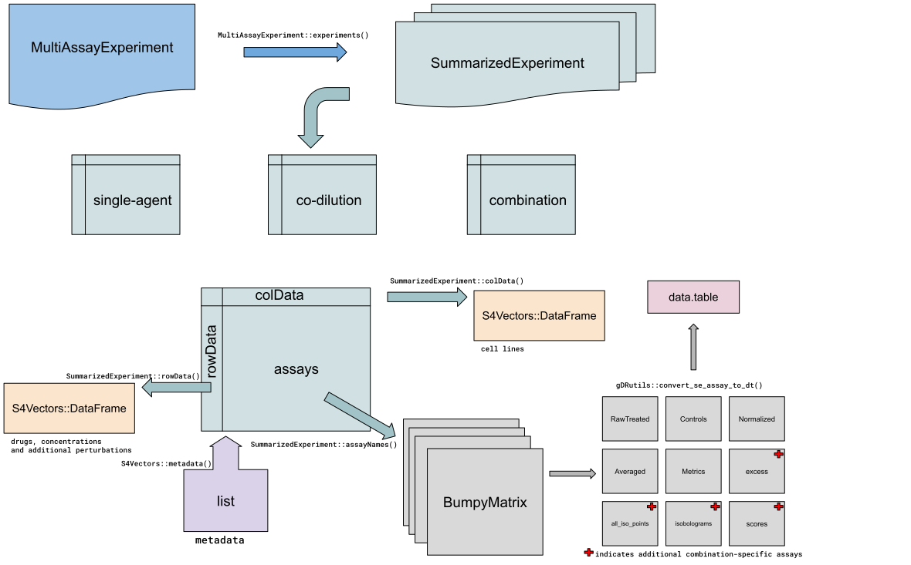

# Introduction

This vignette is dedicated to providing an in-depth exploration of the underlying data model employed in the gDR suite, with a focus on the versatile `r Biocpkg("MultiAssayExperiment")` object – the cornerstone of the gDR ecosystem. The vignette delves into the intricacies of the data model, shedding light on how different components are organized within the `r Biocpkg("MultiAssayExperiment")` object. As the basic and essential object in the gDR, the `r Biocpkg("MultiAssayExperiment")` encapsulates the diverse dimensions of drug response data, providing a unified and coherent framework for analysis. Our primary goal is to equip users with a detailed understanding of the gDRsuite data model and its utilization within the `r Biocpkg("MultiAssayExperiment")` object. Through practical examples and thorough explanations, we aim to demonstrate how gDRcore's core functions and pipeline facilitate efficient analysis, providing valuable insights into drug response dynamics. More information about the data processing can be found in the `r Biocpkg("gDRcore")`.




# General overview of the data model

In the gDR suite, the culmination of drug response data is encapsulated in the form of a `r Biocpkg("MultiAssayExperiment")` object, representing a versatile and cohesive framework for the analysis of diverse experimental scenarios.

## Supported Experiments:
The gDR suite accommodates three primary types of experiments within the `r Biocpkg("MultiAssayExperiment")` object:

1. `single-agent` experiment: This involves the assessment of drug responses to a single agent, providing insights into individual treatment effects.

2. `combination` experiments: This explores the interactions between multiple agents, unraveling the complexities of combined drug treatments and their effects.

3. `co-dilution` experiments: Focused on studying the effects of diluting concentrations of compounds, codilution experiments provide valuable data on the concentration-dependent aspects of drug responses.

## SummarizedExperiment objects:
Each experiment within the `r Biocpkg("MultiAssayExperiment")` is represented as a `r Biocpkg("SummarizedExperiment")` object. This encapsulates the essential components necessary for comprehensive analysis:

* `assays`: Containing the actual data, assays provide a numerical representation of drug responses and associated experimental measurements. In gDR, assays are represented by `r Biocpkg("BumpyMatrix")` object.

* `rowData`: Encompassing information related to features, rowData provides context on the entities being analyzed, such as drugs, compounds, or concentrations. In gDR, rowData are represented by `DataFrame` object from `r Biocpkg("S4Vectors")`

* `colData`: Describing the experimental conditions, colData captures metadata associated with the cell lines, including tissues, reference division time, and any relevant covariates. In gDR, colData are represented by `DataFrame` object from `r Biocpkg("S4Vectors")`

* `metadata`: Offering additional information about the experiment, metadata provides a contextual layer to enhance the understanding of the experimental setup.


# MultiAssayExperiment object

At its core, the `r Biocpkg("MultiAssayExperiment")` object is designed to hold a collection of `r Biocpkg("SummarizedExperiment")` objects, each representing a distinct experiment type within the gDR suite. This simplicity ensures a clean and efficient organization of data, facilitating a user-friendly experience.

To extract specific experiments from the `r Biocpkg("MultiAssayExperiment")` object, the `[[` operator can be used For example, to access the data related to combination experiments, one can use `MAE[["combination"]]`, where `MAE` represents the `r Biocpkg("MultiAssayExperiment")` object.

To gain insights into the available experiments within the `r Biocpkg("MultiAssayExperiment")` object, the `MultiAssayExperiment::experiments` function can be used.


# SummarizedExperiment object

The `r Biocpkg("SummarizedExperiment")` object emerges as a pivotal structure, integrating drug response data with essential metadata. This versatile container plays a central role in the storage of information related to drugs, cell lines, and experimental conditions, providing a comprehensive foundation for nuanced analysis within the gDR.

The `r Biocpkg("SummarizedExperiment")` object in gDR comprises four essential components:

## Assays

This section encapsulates the drug response data itself, offering a numerical representation of experimental measurements. Whether it involves single-agent studies, combination treatments, or co-dilution experiments, the assays contain crucial data points for analysis. The list of available assays for a given gDR experiment can be obtained using `SummarizedExperiment::assayNames` on the `r Biocpkg("SummarizedExperiment")` object. The extraction of a specific `assay` can be done using `SummarizedExperiment::assay` function, i.e. `SummarizedExperiment::assay(se, "Normalized")`, where `se` is the `r Biocpkg("SummarizedExperiment")` object, and `Normalized` is the name of the assay within the experiment.

The gDR experiments contain two sets of assays. One set is for single-agent and co-dilution experiments (five basic assays), and another set is for combinations experiments (five basic assays plus four -- combination-specific).

List of assays (combination-specific assays were marked with the asterisk):

1. RawTreated -- stores treated references
2. Controls -- represents untreated, control references
3. Normalized -- represents normalized data to compute RelativeViability and GRValues (default gDR normalization types)
4. Averaged -- stores averaged replicates computed by the mean and standard deviation
5. Metrics -- contains fitted response curves
6. excess (*) -- excess data for each pair of concentration values (represents Bliss excess, HSA excess, and data smoothing values)
7. all_iso_points (*) stores isobologram points
8. isobolograms (*) -- stores isobologram curves
9. scores (*) -- scores data for each pair of concentration values (HSA score, Bliss Score, and CI (combination index) scores)

All assays are stored as `r Biocpkg("BumpyMatrix")` objects.

Assays represented by numbers 3-9 additionally contain information about `normalization_type` to distinguish different metrics calculated for each normalization type (RelativeViability and GRValues by default).

In gDR `r Biocpkg("BumpyMatrix")` objects can be easily transformed into the `r CRANpkg("data.table")` object using `gDRutils::convert_se_assay_to_dt` function. This function also includes information from the rowData and colData.


## rowData

`rowData` provides context on the features being analyzed, `rowData` is dedicated to information about drugs, compounds, or concentrations with their annotations from the database. Additional perturbations and replicates might be also stored in the `rowData`.

`rowData` can be extracted from the `r Biocpkg("SummarizedExperiment")` object using `SummarizedExperiment::rowData` function.

## colData

`colData` represents the experimental cell lines. This includes details about the cell lines and their annotations.

`colData` can be extracted from the `r Biocpkg("SummarizedExperiment")` object using `SummarizedExperiment::colData` function.

## metadata

`metadata` offers an extra layer of information about the experiment itself, metadata provides context to enhance comprehension. This may include details about the experimental design, sources of data, or any other relevant information that aids in the interpretation of results.

`metadata` information can be extracted using `S4Vectors::metadata` function. In gDR object the metadata information is stored as a list.


# Session info {.unnumbered}

```{r sessionInfo, echo=FALSE}
sessionInfo()
```
